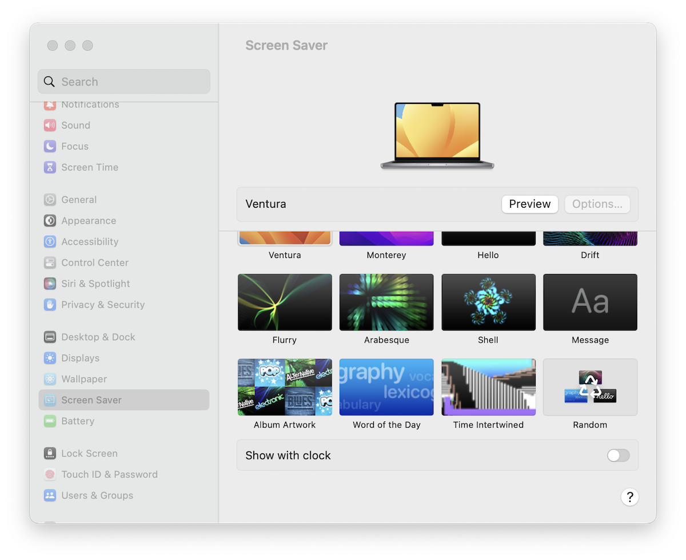

# Time Intertwined Screensaver

This is a Mac screensaver for the [Time Intertwined](https://www.fxhash.xyz/generative/13526) generative art project. It will display one of the 256 tokens randomly each time the screensaver starts.

> ⚠️ Currently, the screensaver doesn't work with the latest MacOS 14 Sonoma. It only displays the still image. If I find a solution, will update.

## Installation

1. Download the zip file from the [Release](https://github.com/cdaein/time-intertwined-screensaver/releases),
1. unzip and double click the `Time Intertwined.saver` file.
1. If your Mac complains, click "Show in Finder" button from the popup.
1. You will be directed to the `Time Intertwined.saver`. Right-click the file and choose "Open". _It's important to "right-click" instead of double-clicking._
1. I don't track you and I only included what's necessary to display the art, but use at your own risk.

## License

Screensaver app code is based on [p5.js-screen-saver](https://github.com/mactkg/p5.js-screen-saver) and released under MIT License.

Time Intertwined generative art is released under CC BY-NC 4.0.
